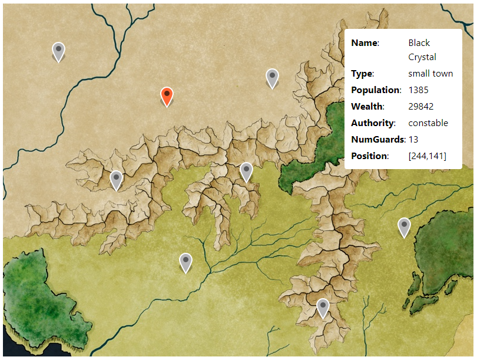

# My Nearmap JS Test Solution

This is my solution to Nearmap's JS test. I built a simple app written in React and Typescript. The task was to place markers on a map based on data provided in the <a href="https://github.com/lgsoftdev/nearmap-js-sol-copy/blob/main/src/assets/data/map-data.json">map-data.json</a> file. The json file contains an array of objects, with the first item being an object with name-value pair "position" that denotes the position of the white information box relative to the background map. The remaining objects in the json file relate to details of various locations on the map where markers need to be placed.

## App features

- A map is displayed on the screen.
- Based on location data from map-data.json, markers are placed on the map to mark various locations.
- When the user clicks on an inactive marker, an information box will appear, showing the information for that location.
- Clicking an inactive marker will change color from grey to red to switch to active.
- When the user clicks on an active marker, the information box will diappear.
- Clicking an active marker will change color from red to grey to switch to inactive.
- When the user clicks on the map, an existing active marker will deselect, and the information box will disappear.

## App preview

## Running the app

In the project directory, you can run:

### `npm install`

### `npm run dev`

The app is run in development mode.\
Open [http://localhost:5173](http://localhost:5173) to view it in the browser.

### `npm run test`

A few automated test cases have been prepared. Script can be run to get outcome of test cases.
